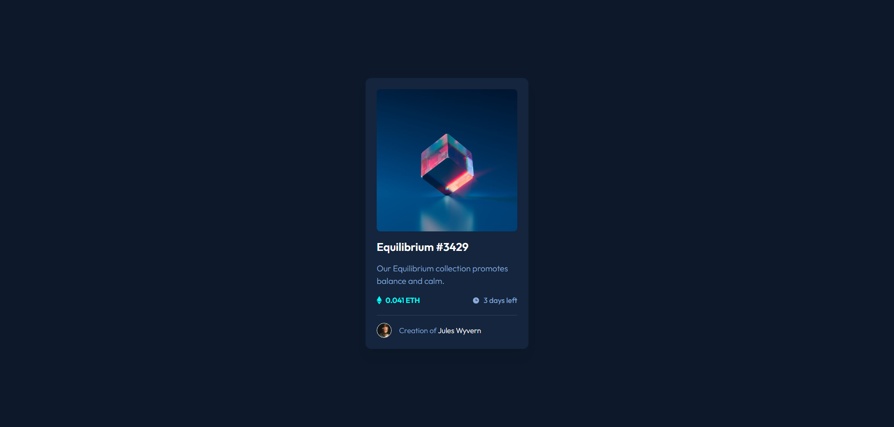
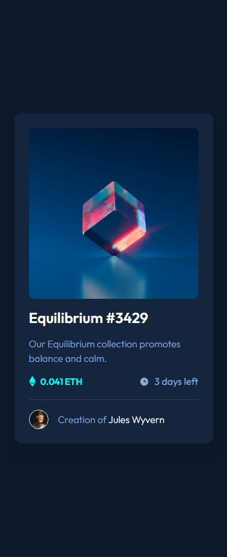

# Frontend Mentor - NFT preview card component solution

This is a solution to the [NFT preview card component challenge on Frontend Mentor](https://www.frontendmentor.io/challenges/nft-preview-card-component-SbdUL_w0U). Frontend Mentor challenges help you improve your coding skills by building realistic projects.

### The challenge

Users should be able to:

- View the optimal layout depending on their device's screen size
- See hover states for interactive elements

### Screenshots

### Links

- Live Site URL: [https://beniusis.github.io/frontendmentor-challenges/nft-preview-card-component](https://beniusis.github.io/frontendmentor-challenges/nft-preview-card-component)

### Built with

- HTML
- CSS
