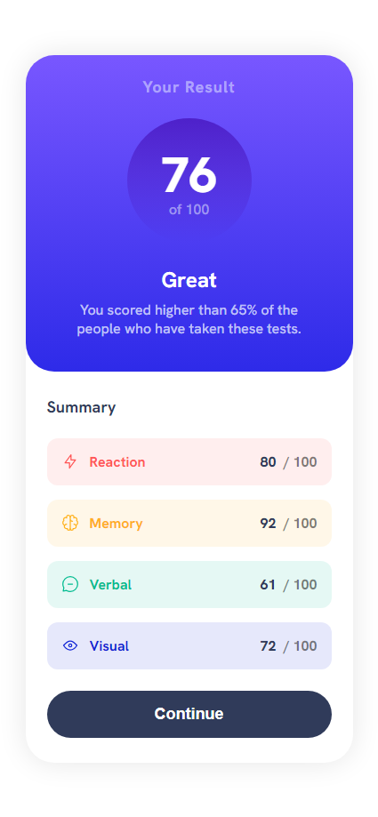

# Frontend Mentor - Results summary component solution

This is a solution to the [Results summary component challenge on Frontend Mentor](https://www.frontendmentor.io/challenges/results-summary-component-CE_K6s0maV). Frontend Mentor challenges help you improve your coding skills by building realistic projects.

### The challenge

Users should be able to:

- View the optimal layout for the interface depending on their device's screen size
- See hover and focus states for all interactive elements on the page
- **Bonus**: Use the local JSON data to dynamically populate the content

### Screenshots

### Links

- Live Site URL: [https://beniusis.github.io/frontendmentor-challenges/results-summary-component](https://beniusis.github.io/frontendmentor-challenges/results-summary-component)

### Built with

- HTML
- CSS
