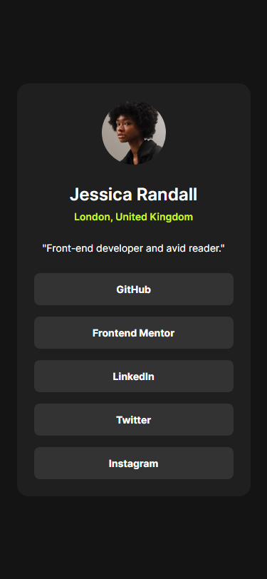

# Frontend Mentor - Social links profile solution

This is a solution to the [Social links profile challenge on Frontend Mentor](https://www.frontendmentor.io/challenges/social-links-profile-UG32l9m6dQ). Frontend Mentor challenges help you improve your coding skills by building realistic projects.

### The challenge

Users should be able to:

- See hover and focus states for all interactive elements on the page

### Screenshots

### Links

- Live Site URL: [https://beniusis.github.io/frontendmentor-challenges/social-links-profile](https://beniusis.github.io/frontendmentor-challenges/social-links-profile)

### Built with

- HTML
- CSS
