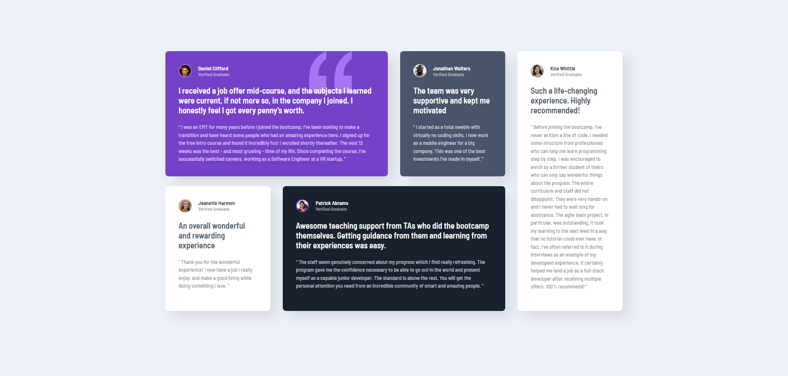

# Frontend Mentor - Testimonials grid section solution

This is a solution to the [Testimonials grid section challenge on Frontend Mentor](https://www.frontendmentor.io/challenges/testimonials-grid-section-Nnw6J7Un7). Frontend Mentor challenges help you improve your coding skills by building realistic projects.

### The challenge

Users should be able to:

- View the optimal layout for the site depending on their device's screen size

### Screenshots

### Links

- Live Site URL: [https://beniusis.github.io/frontendmentor-challenges/testimonials-grid-section](https://beniusis.github.io/frontendmentor-challenges/testimonials-grid-section)

### Built with

- HTML
- CSS
